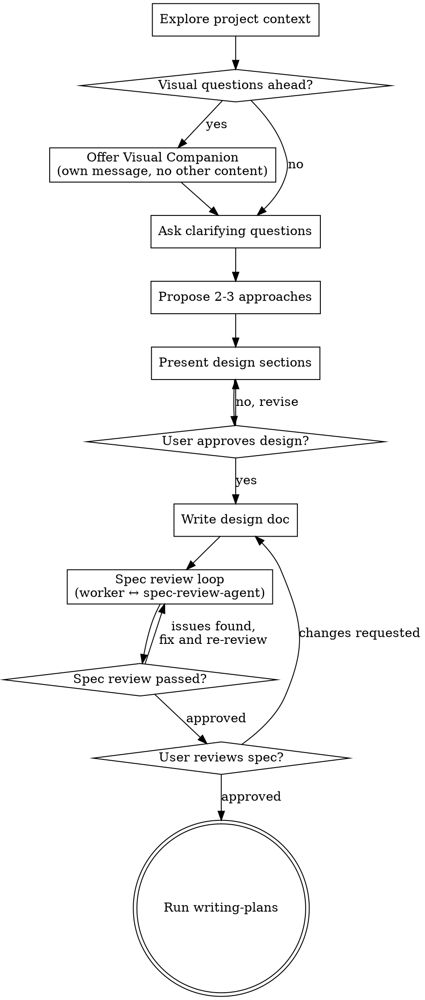

# Brainstorming Ideas Into Designs

Turn rough ideas into approved designs before implementation.

Start by understanding the existing project with pi's tools. Then refine the request one question at a time, propose alternatives, present the design in sections, and get explicit approval before any implementation work.

<HARD-GATE>
Do NOT write code, edit implementation files, invoke implementation skills, or take any implementation action until you have presented a design and the user has approved it.
</HARD-GATE>

## Anti-Pattern: "This Is Too Simple To Need A Design"

Every project goes through this process. A small utility, config tweak, or single-file change can still hide assumptions. The design can be short for simple work, but you MUST present it and get approval before implementation.

## Checklist

Track these steps explicitly and complete them in order:

1. **Explore project context** — inspect relevant files, docs, and recent commits
2. **Offer visual companion** (only if upcoming questions are visual) — this must be its own message. See the Visual Companion section below.
3. **Ask clarifying questions** — one at a time, understand purpose, constraints, and success criteria
4. **Propose 2-3 approaches** — include trade-offs and a recommendation
5. **Present design** — in sections scaled to the work; get approval as you go
6. **Write design doc** — save to `docs/specs/YYYY-MM-DD-<topic>-design.md` unless the user prefers another location
7. **Spec review loop** — use `subagent-driven-dev` in loop mode with the project-local `spec-review-agent`; bail out after 3 iterations if the spec still is not approved
8. **User reviews written spec** — ask the user to review the spec file before moving on
9. **Transition to implementation** — use the local `writing-plans` skill to create the implementation plan

## Process Flow

**The terminal state is running `writing-plans`.** Do NOT jump from brainstorming straight to coding.

## The Process

**Explore project context first:**

- Use `read` and `bash` to inspect the current codebase, docs, and recent commits
- Follow existing patterns before proposing changes
- Before detailed questions, assess scope: if the request really contains multiple independent subsystems, stop and decompose it first
- If it is too large for one spec, help the user break it into sub-projects, then brainstorm only the first one through the normal flow

**Ask clarifying questions one at a time:**

- Ask only one question per turn
- Prefer `questionnaire` for constrained multiple-choice questions when it will make the answer easier
- Open-ended questions are fine when the problem is still fuzzy
- Focus on purpose, constraints, success criteria, and what should be out of scope

**Explore approaches:**

- Propose 2-3 approaches with trade-offs
- Lead with your recommended option and explain why
- Remove unnecessary features aggressively

**Present the design:**

- Once you understand the request, present the design in sections sized to the complexity
- A simple change may only need a few sentences; a nuanced one may need 200-300 words per section
- Ask after each section whether it looks right so far
- Cover the parts that matter for implementation: architecture, files/components, data flow, errors, testing, and migration or rollout if relevant
- Be ready to go back and clarify if something does not line up

**Design for clear boundaries:**

- Break the system into smaller units with one clear purpose each
- Define interfaces and dependencies so each unit can be understood and tested independently
- If a file or component has grown too large, include focused cleanup that directly supports the current goal
- Do not propose unrelated refactors

## After the Design

**Documentation:**

- Write the validated design to `docs/specs/YYYY-MM-DD-<topic>-design.md`
  - User preferences for location override this default
  - Create the directory if it does not exist
- Ask whether the user wants the spec committed; do not commit without approval

**Spec Review Loop:**

1. After writing the spec, request a review from the `spec-review-agent`
2. Stop only when the reviewer outputs `Spec ready for planning: Yes` or 3 iterations are exhausted. 
3. If loop exceeds 3 iterations, surface to human for guidance

**User Review Gate:**

After the spec review passes, ask the user to review the written spec before proceeding:

> "Spec written to `<path>`. Please review it and let me know if you want any changes before I write the implementation plan."

Wait for the user's response. If they request changes, update the spec and repeat the spec review step. Only proceed once the user approves.

**Implementation:**

- Use the `writing-plans` skill to create a detailed implementation plan
- Do NOT invoke other skills directly from brainstorming

## Key Principles

- **One question at a time** - Don't overwhelm the user
- **Multiple choice preferred when helpful** - Easier to answer than open-ended questions
- **YAGNI ruthlessly** - Remove unnecessary features from the design
- **Explore alternatives** - Always show 2-3 approaches before settling
- **Incremental validation** - Present the design, get approval, then write the spec
- **Be flexible** - Go back and clarify when something does not make sense

## Visual Companion

A browser-based companion for showing mockups, diagrams, and visual options during brainstorming. Accepting the companion means it is available for questions that benefit from visual treatment; it does NOT mean every question goes through the browser.

**Offering the companion:** When you expect upcoming questions to involve visual content, offer it once for consent:
> "Some of what we're working on might be easier to explain if I can show it to you in a web browser. I can put together mockups, diagrams, comparisons, and other visuals as we go. This feature is still new and can be token-intensive. Want to try it? (Requires opening a local URL)"

**This offer MUST be its own message.** Do not combine it with clarifying questions, summaries, or anything else. Wait for the user's response before continuing. If they decline, continue in text only.

**Per-question decision:** Even after the user accepts, decide for each question whether to use the browser or the terminal. The test: **would the user understand this better by seeing it than reading it?**

- **Use the browser** for mockups, wireframes, layout comparisons, architecture diagrams, and other visual comparisons
- **Use the terminal** for requirements questions, conceptual choices, trade-offs, scope decisions, and other text-first discussion

A question about a UI topic is not automatically a visual question. "What does personality mean here?" is conceptual and belongs in the terminal. "Which layout works better?" is visual and belongs in the browser.

If they agree to the companion, read `visual-companion.md` before proceeding.
